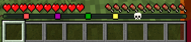
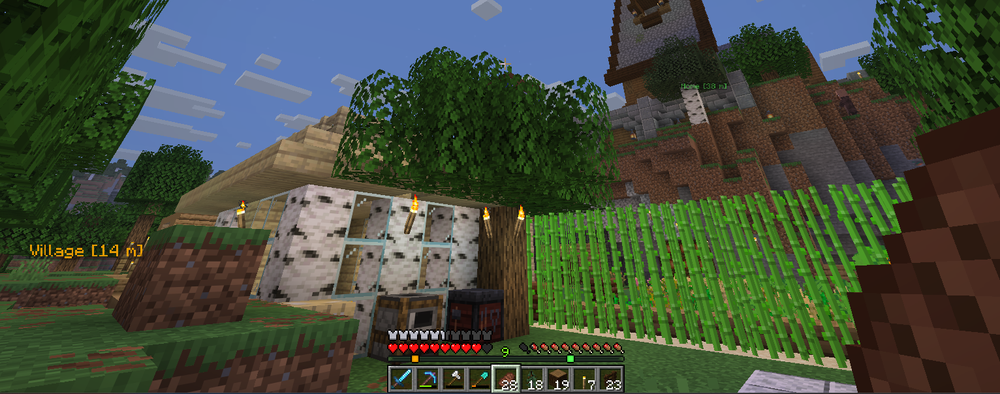
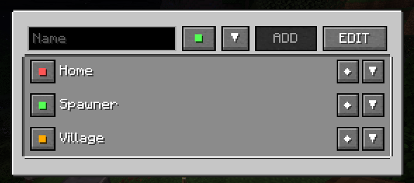

# Vanilla Waypoints

Vanilla Waypoints is a Fabric mod that adds custom and death waypoints while using Minecraft's native Locator Bar.



Waypoints can also be displayed as scalable 3D labels in the world.



## Requirements

| Component | Required version |
| --- | --- |
| Minecraft | 26.2 |
| Fabric Loader | 0.19.3 or newer |
| Fabric API | 0.156.0+26.2 or a compatible 26.2 release |
| Java | 25 or newer |

The mod must be installed on the LAN host/server and on every player who needs to use it

## Installation

1. Install Fabric Loader for Minecraft 26.2.
2. Download and install Fabric API for Minecraft 26.2.
3. Copy `vanilla-waypoints-1.0.0.jar` into the Minecraft `mods` directory.
4. Copy the same mod version to every computer joining the LAN world.
5. Start the Fabric profile and open or join the world.

On Windows, the standard mods directory is:

```text
%APPDATA%\.minecraft\mods
```

## Waypoint screen

Press **U** to open the waypoint screen. 



### Adding a waypoint

1. Enter a name.
2. Click the color square to cycle through colors.
3. (Optional) Expand the coordinate section to enter custom X, Y, and Z values.
5. Select **ADD**.

Waypoint names may contain 1–32 letters, numbers, underscores, or hyphens.

### Managing waypoints

- Click the visibility button to show or hide a waypoint on the Locator Bar and in the world.
- Expand a row to display its X, Y, Z, and dimension information.
- Click a waypoint's color square to cycle its color.
- Select **EDIT** to reveal the `3D+`/`3D−` control and owner-only delete button.

## Player-specific visibility

Visibility and 3D rendering are personal settings:

- If one player hides a shared waypoint, it remains visible to everyone else.
- If one player disables its 3D label, other players keep their own 3D labels.
- Personal settings are stored by player UUID and survive reconnecting to the world.
- Hidden shared waypoints remain in the menu and can be enabled again.

The waypoint color is shared. Changing the color of a shared waypoint updates it for all players. 
** Only the owner can delete the waypoint. **

## Sharing waypoints

Custom waypoints are private by default. The owner can share or unshare them with commands:

```mcfunction
/point share home
/point unshare home
```

Shared waypoints appear in the waypoint menu, on the native Locator Bar, and as 3D world labels for other players using the mod. A shared point is marked with an arrow in the list.

Other players may safely change its color and their own visibility or 3D preferences, but they cannot delete it.

## Death waypoints

When a player dies, the mod creates a white skull waypoint named `Death #1`, `Death #2`, and so on. 

- Up to five recent death waypoints are retained.
- When another death occurs, markers outside the five-minute history window are removed.
- Reaching within four blocks of a death location removes that marker after a short safety delay.
- Death waypoints are private and belong to the player who died.

All death waypoints can be removed manually with:

```mcfunction
/point death clear
```

## Commands

| Command | Description |
| --- | --- |
| `/point` | Displays command help. |
| `/point add <name>` | Adds a waypoint at the current position using the default command color. |
| `/point add <name> <color>` | Adds a waypoint at the current position with a named or hexadecimal color. |
| `/point add <name> <x> <y> <z>` | Adds a waypoint at custom coordinates. |
| `/point add <name> <x> <y> <z> <color>` | Adds a waypoint at custom coordinates with a selected color. |
| `/point remove <name>` | Removes an owned custom waypoint. |
| `/point list` | Lists owned custom and numbered death waypoints. |
| `/point info <name>` | Shows coordinates, dimension, color, and status. |
| `/point color <name> <color>` | Changes a custom waypoint's color. |
| `/point enable <name>` | Shows an owned waypoint for the command sender. |
| `/point disable <name>` | Hides an owned waypoint for the command sender. |
| `/point share <name>` | Shares a waypoint with all players in the world. |
| `/point unshare <name>` | Makes a waypoint private again. |
| `/point death` | Lists detailed death waypoint information. |
| `/point death clear` | Removes all of the sender's death waypoints. |

### Command examples

```mcfunction
/point add home
/point add village red
/point add mine 120 32 -450
/point add portal -80 70 210 AA55FF
/point color home gold
/point share village
```

## Multiplayer behavior and permissions

The server or LAN host is authoritative and stores all waypoint data.

| Action | Owner | Other player with a shared waypoint |
| --- | --- | --- |
| View in the list | Yes | Yes |
| Change color | Yes | Yes, globally |
| Hide/show | Yes, personal | Yes, personal |
| Enable/disable 3D | Yes, personal | Yes, personal |
| Delete | Yes | No |
| Share/unshare | Yes | No |

The current limit is 128 custom waypoints per owner. A synchronization snapshot can contain up to 256 accessible entries for one player.

## Building from source

The project includes a Gradle wrapper. Java 25 is required.

Windows PowerShell:

```powershell
$env:GRADLE_USER_HOME = (Resolve-Path '.gradle').Path
.\gradlew.bat build
```

Linux or macOS:

```bash
./gradlew build
```

The playable JAR is generated at:

```text
build/libs/vanilla-waypoints-1.0.0.jar
```